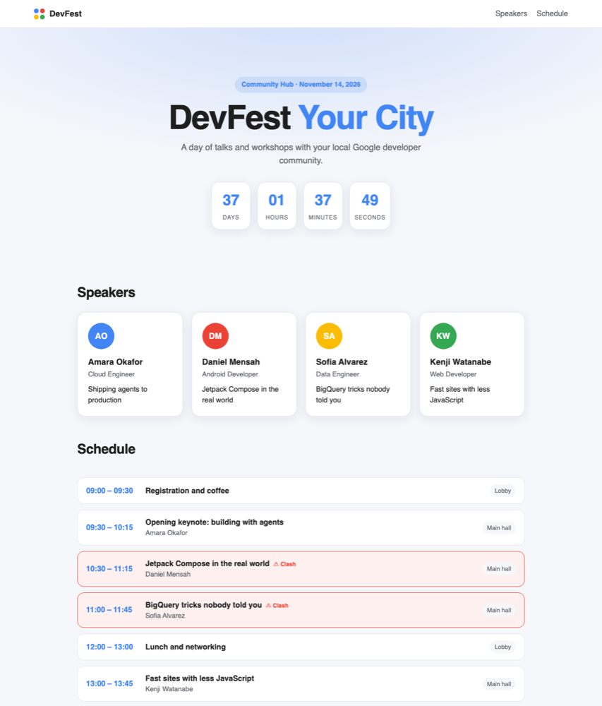
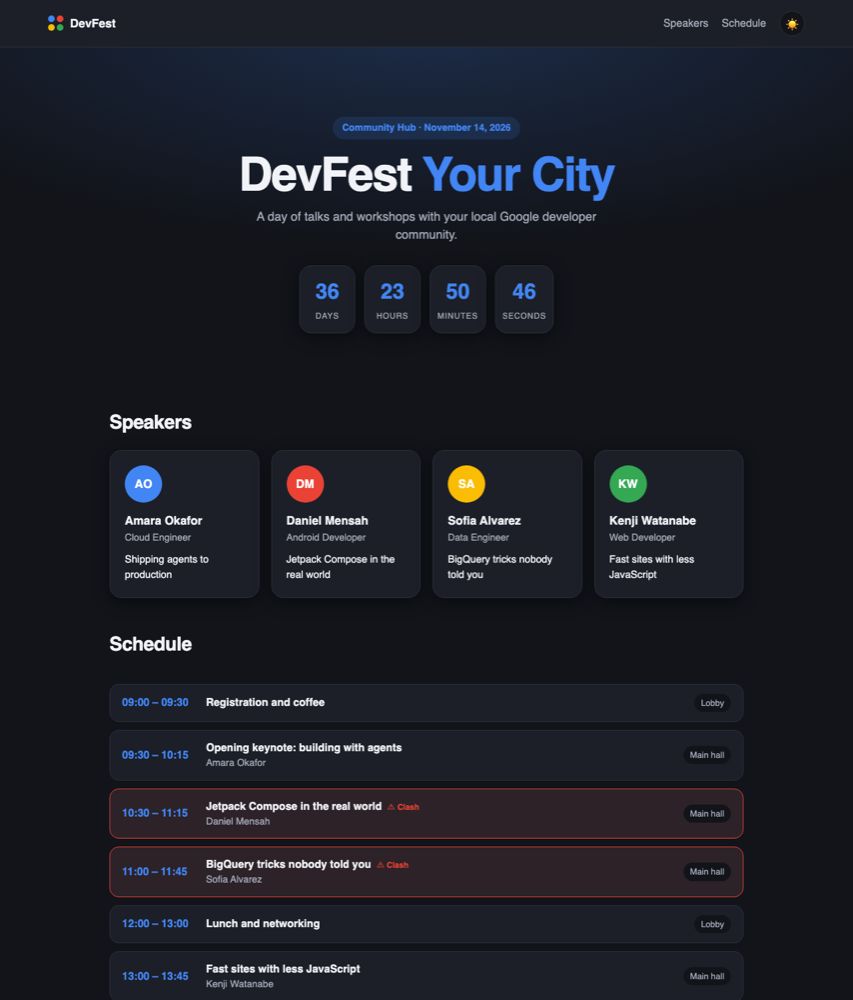
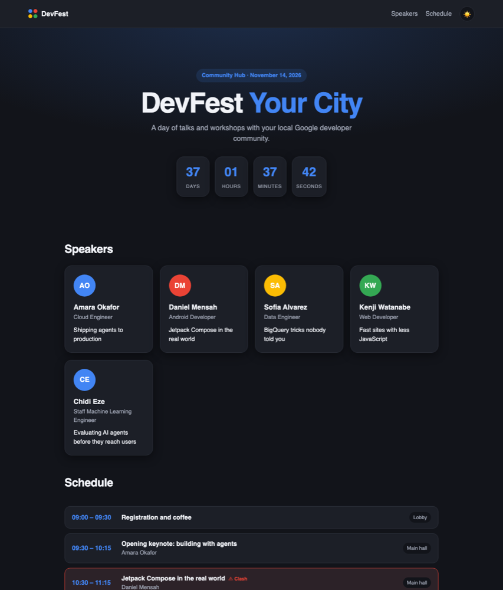
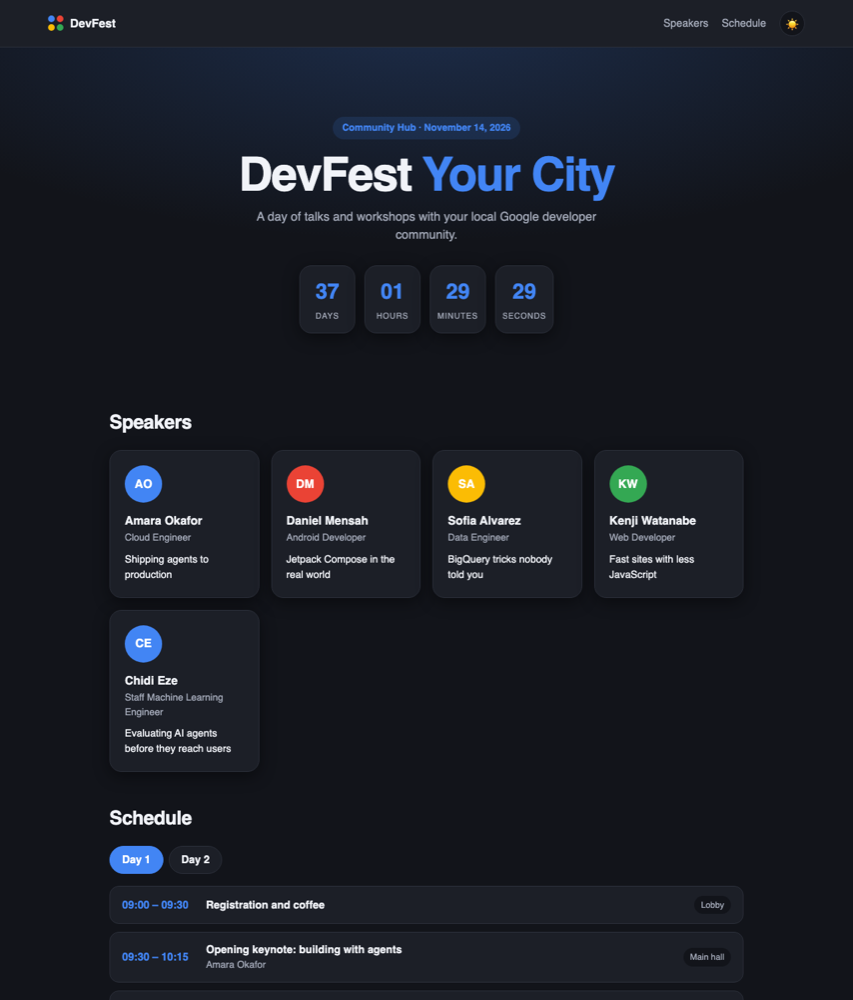

<div align="center">

# DevFest Workshop Site

### Build a real event website live with the Antigravity CLI

Every prompt changes the page **in your browser, in real time**.
Follow along on your own laptop, or just watch the screen.

**https://github.com/engr-krooozy/agy-devfest-workshop**

`plain HTML/CSS/JS` · `Python 3 only` · `no installs, no API keys, no build step`



</div>

---

## The idea

You get a small DevFest event site. During the workshop the agent (`agy`) changes it:
adds dark mode, adds a speaker, builds a second conference day, fixes a bug.
The site **reloads itself the moment a file changes**, so you see every edit land.

It also works for **any DevFest location**. The city, date and venue all live in one
file, [`site/data/event.json`](site/data/event.json). Change `"city"` to yours and the whole page follows.

## Get running in 60 seconds

```bash
git clone https://github.com/engr-krooozy/agy-devfest-workshop.git
cd agy-devfest-workshop
make preflight          # every line should say OK
make serve              # then open http://localhost:8000
```

Now open three windows side by side:

| Window | What you see |
|---|---|
| **Terminal 1** | `agy`, where the prompts go |
| **Browser** | http://localhost:8000, the site, reloading itself |
| **Terminal 2** (optional) | `make follow`, the files the agent is touching, live |

## Make it yours (do this first)

Open `site/data/event.json` and change the city:

```json
{ "city": "Your City", "date": "2026-11-14", "venue": "Community Hub" }
```

Save. The headline, countdown and date change in your browser straight away.
(After the last step of the workshop, the browser tab title and footer follow too. Why they don't yet is part of the demo.)

## What changes, step by step

Each row is one thing the agent does. **You can see every one in the browser.**

| Slide | You ask the agent | What you see in the browser | Replay it |
|---|---|---|---|
| 13 | *Add a dark mode toggle* (in **plan** mode) | **Nothing.** Plan mode never writes | none |
| 14 | *Add a dark mode toggle to the header* | A 🌙 button appears. Click it and the whole site goes dark | `step-14-dark-mode` |
| 15 | `/fork`, change the accent colour, `/resume` | The page turns red and **stays red**. A fork copies the chat, not your files | none |
| 18 | *Find everything hard-coded to the event* | Nothing. It finds 3 spots that ignore `event.json` | none |
| 24 | `agy -p` turns a bio into a speaker | A **5th speaker card** pops in | `step-24-new-speaker` |
| 25 | Install the `/standup` skill | Nothing on the page. A new slash command appears | `step-25-standup-skill` |
| 28 | *Add a second conference day, run the tests* | **Day 1 / Day 2 tabs** appear | `step-28-two-days` |
| 29 | *Fix the failing test* | The red **⚠ Clash** badges vanish | `step-29a-fix-clash` |
| 29 | *Make everything read from event.json* | Tab title, footer and server banner now follow your city | `step-29b-single-source` |

### Before and after

| Dark mode (step 14) | New speaker (step 24) |
|---|---|
|  |  |

| Two days (step 28) | Clash fixed (step 29) |
|---|---|
|  |  |

## Three ways to follow

| You want to... | Do this |
|---|---|
| **Watch** | Look at the screen. Run `./scripts/step.sh 14` to see the exact diff of a step |
| **Skip ahead** | `git checkout step-14-dark-mode` and the site becomes that step. `make reset` goes back |
| **Do it yourself** | `git checkout demo-start`, open `agy`, paste the prompts from [DEMO.md](DEMO.md) |

## What is in the repo

```
site/
├── index.html        the page skeleton
├── styles.css        the look (colour variables at the top)
├── app.js            fills the page from the JSON files
└── data/
    ├── event.json    name, city, date, venue, accent colour
    ├── speakers.json the speaker cards
    └── schedule.json the timeline (Day 1 only to start)
serve.py              tiny dev server with live reload
tests/                must always pass: data and page checks
bugs/                 fails on purpose: a schedule clash, written as a test
demo/                 files used live: speaker bio, JSON schema, the /standup skill
.agents/skills/       skills the agent loads. explain-flow ships with the repo
AGENTS.md             the rules file the agent reads every session
scripts/              follow, step, reset, preflight, add-speaker
```

## Commands

| Command | What it does |
|---|---|
| `make serve` | the site with live reload on port 8000 |
| `make test` | tests that must pass |
| `make bugs` | the bug report, failing on purpose |
| `make follow` | live list of files the agent is changing |
| `make steps` | list every workshop step |
| `make reset` | back to the clean starting point |
| `make preflight` | check everything is ready |

---

<div align="center">
Built for DevFest · GDG communities everywhere · <code>agy</code>
</div>
