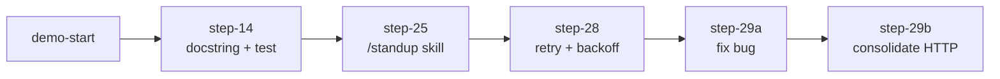

<div align="center">

```
  ┌─────────────────────────────────────────────┐
  │   {DevFest}  Abeokuta 2026                  │
  │                                             │
  │   $ agy          the agent in your terminal │
  └─────────────────────────────────────────────┘
```

# agy-devfest

**The follow-along repo for the Antigravity CLI workshop.**
Watch the agent change real code, then replay every change yourself.

`Python 3.9+` · `standard library only` · `no network needed for tests` · `no API keys`

</div>

---

## What is this?

`pagetext` is a tiny tool that fetches a web page and prints just the readable text.
It is small on purpose: **every file fits on one screen**, so you can follow what the
agent does without scrolling.

During the talk I drive `agy` (Antigravity CLI) on this repo. Every change it makes is
saved as a **git tag**, so you can see it, replay it, or skip ahead.



## Follow along in 3 ways

| You want to... | Do this |
|---|---|
| **Watch** from your seat | Clone the repo, then run `./scripts/step.sh 14` when I reach slide 14 |
| **Replay** every change | `git checkout step-14-docstring-and-test`, then step by step |
| **Do it yourself** with `agy` | `git checkout demo-start`, open `agy`, paste the prompts from [DEMO.md](DEMO.md) |

```bash
git clone <this repo> && cd agy-devfest
make preflight        # every line should say OK
make steps            # list every workshop step
```

## The 60-second tour

```bash
make serve                                   # terminal 1: a local demo site, no wifi needed
python3 -m pagetext.fetch http://localhost:8000/index.html     # terminal 2
make test                                    # 6 tests, all green
make bugs                                    # 2 tests, RED on purpose. That is a bug report.
```

## Repo map

```
agy-devfest/
├── pagetext/
│   ├── fetch.py        fetch a URL, print its text         (UA: pagetext, timeout 10s)
│   ├── extract.py      HTML to plain text
│   ├── robots.py       may we fetch this URL?               (UA: pagetext-robots, timeout 5s)
│   └── linkcheck.py    do these links still work?           (UA: pagetext-linkcheck, timeout 3s)
├── tests/              green tests: these must always pass
├── bugs/               RED tests: a bug report written as tests
├── demo/
│   ├── site/           local web page to fetch (has a script tag, a dead link, a robots.txt)
│   ├── standup.md      a skill we install live (slide 25)
│   ├── semver.schema.json   JSON schema for headless output (slide 24)
│   └── settings.example.json  permissions example (slide 26)
├── .agents/skills/     skills the agent loads. explain-flow ships with the repo
├── AGENTS.md           the rules file the agent reads every session (slide 28)
├── DEMO.md             every prompt, in slide order, copy-paste ready
└── scripts/            follow.sh, step.sh, reset.sh, preflight.sh, serve.sh
```

Notice that `fetch.py`, `robots.py` and `linkcheck.py` each make their own HTTP call,
with a different user agent and timeout. The agent finds this on slide 18 and we clean
it up on slide 29.

## The workshop, slide by slide

| Slide | Section | What changes in the repo | Tag |
|---|---|---|---|
| 10 | First run | Nothing. The agent reads and notices `fetch.py` exists | none |
| 13 | Plan mode | Nothing. Plan mode is read-only. **No diff is the point** | none |
| 14 | Artifacts | `fetch()` gets a docstring and a new `tests/test_fetch.py` | `step-14-docstring-and-test` |
| 15 to 16 | Conversation | Nothing. We rewind, fork, resume | none |
| 18 | Subagents | Nothing. Read-only research across the repo | none |
| 23 to 24 | Headless | Nothing in the repo. Output goes to the terminal | none |
| 25 | Skills | `demo/standup.md` is copied into `.agents/skills/` | `step-25-standup-skill` |
| 26 to 27 | Guardrails | Nothing. We read permissions and run sandboxed | none |
| 28 | Verification loop | Retry with backoff in `fetch()`, tests run by the agent | `step-28-retry-backoff` |
| 29 | Open floor | Fix the `bugs/` tests | `step-29a-fix-script-style-bug` |
| 29 | Open floor | Consolidate HTTP code into `fetch.py` | `step-29b-consolidate-http` |

> **Reading a diff is the skill.** After every step, run `git diff` (or `./scripts/follow.sh`).
> The agent writes code, you review it.

## Commands

| Command | What it does |
|---|---|
| `make preflight` | check that everything is ready |
| `make test` | tests that must pass |
| `make bugs` | tests that fail on purpose |
| `make follow` | live view of what the agent is changing |
| `make steps` | list every workshop step |
| `make reset` | back to `demo-start` |
| `make serve` | local demo site on port 8000 |

## For the presenter

Open two panes: `agy` on the left, `./scripts/follow.sh` on the right. Everything the
agent touches shows up on the right, in colour, within a second.
Rehearsal notes are in the speaker notes of the deck and in [DEMO.md](DEMO.md).
If anything stalls: `git checkout step-NN-...` gets you to the expected result.

---

<div align="center">
Built for DevFest Abeokuta 2026 · GDG Abeokuta · <code>agy</code>
</div>
